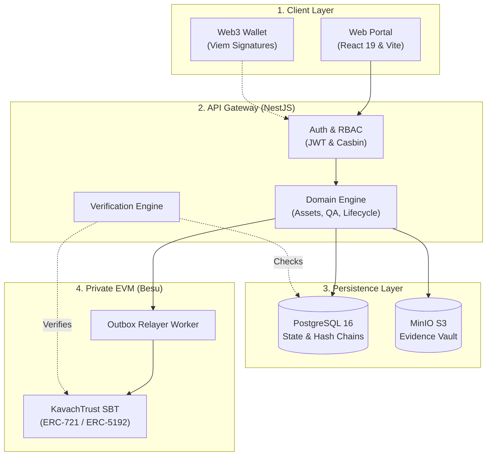

# KavachTrust — Sovereign Defence Asset Traceability & Digital Passport Platform

<p align="center">
  
  
  
  
</p>

<p align="center">
  <a href="https://nodejs.org/"></a>
  <a href="https://pnpm.io/"></a>
  <a href="https://react.dev/"></a>
  <a href="https://nestjs.com/"></a>
  <a href="https://www.prisma.io/"></a>
  <a href="https://min.io/"></a>
  <a href="https://soliditylang.org/"></a>
  <a href="SECURITY.md"></a>
  <a href="CONTRIBUTING.md"></a>
</p>

---

## 🎯 Executive Overview

**KavachTrust** is an enterprise-grade defense asset traceability and digital product passport platform. Engineered to eliminate counterfeit components, unverified maintenance records, and supply-chain vulnerabilities in military and aerospace manufacturing, KavachTrust delivers **cryptographic non-repudiation**, **tamper-evident audit logging**, and **non-transferable Soulbound Token (SBT)** certification on a private EVM blockchain.

### The Problem It Solves
- **Counterfeit & Uncertified Parts**: Critical defense equipment requires verifiable manufacturing and material provenance from Tier-3 suppliers to final assembly.
- **Vulnerable Maintenance & QA Records**: Paper logs and centralized relational databases are vulnerable to retroactive tampering and unauthorized alterations.
- **Inter-Agency Trust Deficit**: Multiple stakeholders (defense ministries, private contractors, quality inspectors, military auditors) need an authoritative, single source of truth without disclosing classified schematics publicly.

---

## ⚡ Key Capabilities

| Capability | Technical Realization |
| :--- | :--- |
| **Digital Asset Passports (SBT)** | Permanent on-chain issuance using **ERC-721 + IERC-5192** Minimal Soulbound Token standards on Hyperledger Besu. Tokens are locked to the asset and strictly non-transferable. |
| **Cryptographic Evidence Vault** | Client-side **SHA-256 pre-hashing** and MinIO S3 object storage for CAD models, X-ray scans, metallurgical test reports, and supplier declarations. |
| **Tamper-Evident Audit Trail** | Sequential SHA-256 hash chaining ($\text{Hash}_n = \text{SHA-256}(\text{Hash}_{n-1} \parallel \text{Payload}_n)$) enabling real-time detection of database row tampering. |
| **Merkle Checkpointing** | Periodic batch checkpoints that generate deterministic Merkle Roots anchored to the blockchain for high-throughput zero-knowledge verification. |
| **Zero-Trust Casbin RBAC** | Strict role-based access control protecting all lifecycle transitions across 4 predefined defense roles with JWT token authentication. |
| **Transactional Outbox Worker** | Asynchronous, resilient event dispatch ensuring at-least-once delivery of blockchain state transitions without distributed two-phase commit locks. |
| **End-to-End Chain of Custody** | Lifecycle tracking from supplier raw material lots to facility shipments, custody transfers, and physical QR / RFID hardware bindings. |
| **Accessibility by Design** | Engineered to conform with **WCAG 2.1 Level AA** and Section 508, featuring keyboard navigation, high contrast, and screen-reader readiness. |

---

## 🏛️ System Architecture



<details open>
<summary><b>View Text Architecture Diagram (Offline / Fallback)</b></summary>

```text
┌─────────────────────────────────────────────────────────────────────────────┐
│ 1. CLIENT LAYER                                                             │
│    • Web Portal: React 19 + Vite + Tailwind CSS (Role-Based Workspaces)    │
│    • Web3 Wallet: Viem Cryptographic Signatures (EIP-191 / EIP-712)         │
└──────────────────────────────────────┬──────────────────────────────────────┘
                                       │ HTTPS / REST (TLS 1.3)
                                       ▼
┌─────────────────────────────────────────────────────────────────────────────┐
│ 2. API GATEWAY (NestJS)                                                     │
│    • Auth & Access: Stateless JWT Bearer + Casbin Least-Privilege RBAC      │
│    • Domain Services: Asset Management, QA Inspections, Lifecycle State     │
│    • Verification Engine: Cross-domain integrity & hash-chain checks        │
└──────────────┬───────────────────────┬───────────────────────┬──────────────┘
               │                       │                       │
               ▼                       ▼                       ▼
┌─────────────────────────┐ ┌──────────────────────┐ ┌────────────────────────┐
│ 3. PERSISTENCE LAYER    │ │ 3. OBJECT STORAGE    │ │ 4. BLOCKCHAIN LAYER    │
│    PostgreSQL 16        │ │    MinIO S3 Vault    │ │    Hyperledger Besu    │
│  • Domain Entities      │ │  • Immutable Files   │ │  • QBFT Private EVM    │
│  • Audit Hash-Chains    │ │  • SHA-256 Digests   │ │  • Outbox Worker Relayer│
│  • Transactional Outbox │ │  • Pre-signed URLs   │ │  • KavachTrustSBT      │
└─────────────────────────┘ └──────────────────────┘ └────────────────────────┘
```
</details>

### Architectural Tiers

1. **Client Tier**: Role-gated React 19 dashboards for administrators, procurement officers, inspectors, and auditors with Viem cryptographic wallet signatures.
2. **API Gateway Tier**: NestJS services enforcing Casbin authorization, asset lifecycle state invariants, and cross-domain verification.
3. **Persistence Tier**: PostgreSQL for relational state and sequential SHA-256 audit hash-chains; MinIO for content-addressed evidence files.
4. **Blockchain Tier**: Transactional outbox worker relaying finalized certification records to a private Hyperledger Besu network as non-transferable Soulbound Tokens.

---

## 👥 Role-Based Access Control Matrix

The platform segregates duties into four standard defense operating roles:

```
┌─────────────────────────────────┬────────────────────────────────────────────────────────┐
│ Role                            │ Operational Responsibilities & Permissions             │
├─────────────────────────────────┼────────────────────────────────────────────────────────┤
│ SYSTEM_ADMIN                    │ Platform configuration, user management, role grants,  │
│                                 │ system-level integrity audits, node health monitoring. │
├─────────────────────────────────┼────────────────────────────────────────────────────────┤
│ PROCUREMENT_SUPPLY_CHAIN_OFFICER│ Supplier declarations, lot & batch intake, shipment    │
│                                 │ dispatches, custody handoff acknowledgments.           │
├─────────────────────────────────┼────────────────────────────────────────────────────────┤
│ QUALITY_INSPECTOR               │ Physical QA inspections, PASS/FAIL checklist sign-off, │
│                                 │ technical evidence attachment, SBT certification clearance│
├─────────────────────────────────┼────────────────────────────────────────────────────────┤
│ AUDITOR                         │ Independent read-only compliance review, cryptographic │
│                                 │ audit hash chain verification, Merkle proof inspection.│
└─────────────────────────────────┴────────────────────────────────────────────────────────┘
```

---

## 📁 Repository Layout

```text
├── backend/            NestJS 10 REST API, Prisma ORM schema, workers, unit tests
│   ├── prisma/         Database schema (schema.prisma), migrations, seed scripts
│   ├── src/            Domain modules: identity, assets, trust, outbox, verification
│   └── docs/           Backend architecture, deployment guides, and API specs
├── frontend/f1/        React 19 + Vite 8 web application with Tailwind CSS v4
│   ├── components/     Accessible UI components, layout shell, RoleGuard
│   ├── pages/          Domain views: Assets, Audit, Certifications, Blockchain
│   └── routes.tsx      Declarative route hierarchy with authentication barriers
├── contracts/          Hardhat EVM project for Solidity smart contracts
│   ├── contracts/      KavachTrustSBT.sol (ERC-721 + IERC5192) & interfaces
│   └── scripts/        Deployment and verification scripts for Besu / local nodes
├── besu/               Private Hyperledger Besu QBFT network configuration
│   ├── genesis.json    Genesis block configuration with pre-allocated accounts
│   └── key.priv        Private node validator key
├── docs/               System guides, deployment instructions, and forensic archives
├── e2e/                Playwright automated end-to-end and API testing suites
├── docker-compose.yml  Development orchestration for PostgreSQL, MinIO, and Besu
├── SECURITY.md         Vulnerability disclosure SLA, zero-trust security policy
├── ACCESSIBILITY.md    WCAG 2.1 AA conformance statement and keyboard guidelines
└── package.json        Workspace scripts for multi-package execution
```

---

## 🚀 Quick Start Guide

### Prerequisites
- **Node.js**: `>= 20.0.0`
- **pnpm**: `>= 9.0.0`
- **Docker Desktop** with Docker Compose

### 1. Clone & Install Dependencies

```bash
git clone https://github.com/prathmesh2028/NOVEXA_BLOCKCHAIN.git
cd NOVEXA_BLOCKCHAIN

# Install root, backend, and contract workspace dependencies
pnpm install
pnpm --dir backend install
pnpm --dir contracts install
```

### 2. Launch Local Supporting Infrastructure

Start PostgreSQL, MinIO, and the Hyperledger Besu private EVM node:

```bash
docker compose up -d
```

Verify service availability:
- **PostgreSQL**: `localhost:5432` (`kavachtrust` database)
- **MinIO Console**: `http://localhost:9001` (Credentials: `kavach_minio_dev` / `kavach_minio_secret_dev`)
- **MinIO S3 API**: `http://localhost:9000`
- **Besu JSON-RPC**: `http://localhost:8545`

### 3. Initialize Database & Seed Demo Data

```bash
# Generate Prisma Client & apply schema migrations
pnpm --dir backend prisma:generate
pnpm --dir backend prisma:migrate:deploy

# Seed standard defense users, component batches, and initial audit records
pnpm --dir backend prisma:seed
```

> **Default Seed Accounts**:
> Standard password for all seed accounts is `password`.
> - **System Admin**: `admin@kavachtrust.gov.in`
> - **Procurement Officer**: `procurement@kavachtrust.gov.in`
> - **Quality Inspector**: `inspector@kavachtrust.gov.in`
> - **Auditor**: `auditor@kavachtrust.gov.in`

### 4. Deploy Smart Contracts (Optional if already configured)

Compile and deploy `KavachTrustSBT` to the local Besu node:

```bash
pnpm --dir contracts compile
pnpm --dir contracts deploy
```

### 5. Start Frontend and Backend

Run both services concurrently from the root workspace:

```bash
# Concurrently starts Vite frontend (:5173) and NestJS backend (:3001)
pnpm start
```

Or start them individually in separate terminals:

```bash
# Terminal 1: Backend API
pnpm dev:backend

# Terminal 2: Frontend Client
pnpm dev:frontend
```

Open your browser to:
- **Web Application**: `http://localhost:5173`
- **Backend API & Swagger Docs**: `http://localhost:3001/docs`

---

## 🛠️ Essential Commands

```bash
# ─── Development ──────────────────────────────────────────────
pnpm start                  # Concurrently start frontend & backend
pnpm dev:frontend           # Start Vite development server
pnpm dev:backend            # Start NestJS API in watch mode

# ─── Building ─────────────────────────────────────────────────
pnpm build:frontend         # Build frontend production bundle
pnpm build:backend          # Compile backend NestJS application
pnpm format                 # Format source code using oxfmt

# ─── Testing ──────────────────────────────────────────────────
pnpm --dir backend test     # Run backend unit tests (Vitest)
pnpm --dir backend test:cov # Run backend coverage reports
pnpm --dir contracts test   # Run smart contract Hardhat tests
pnpm exec playwright test   # Run end-to-end integration tests

# ─── Infrastructure ───────────────────────────────────────────
docker compose down         # Stop background Docker containers
docker compose down -v      # Stop containers and wipe volumes (clean reset)
```

---

## 🔐 Security & Non-Repudiation

KavachTrust incorporates defense-in-depth principles:
- **No Hardcoded Secrets**: Strictly configured through environment variables.
- **Content-Addressed Storage**: All evidence documents in MinIO are immutable and identified by SHA-256 digest.
- **Idempotency Protection**: Outbox and minting requests utilize unique idempotency keys to prevent duplicate transactions.
- **Strict Transfer Lock**: Non-transferable ERC-5192 tokens prevent certification tampering or spoofing.

For our full vulnerability disclosure policy and response SLAs, consult [SECURITY.md](SECURITY.md).

---

## ♿ Accessibility Commitment

We are dedicated to providing an inclusive user experience across all defense operational environments:
- **WCAG 2.1 Level AA Compliant**: High-contrast ratios (≥ 4.5:1), adaptive dark/light themes.
- **Complete Keyboard Operability**: Focus indicators, modal trapping, escape handling.
- **Screen Reader Optimized**: Programmatic form associations, live status updates (`aria-live`).

For technical specifications and audit reports, consult [ACCESSIBILITY.md](ACCESSIBILITY.md).

---

## 📚 Complete Documentation Index

For in-depth guides and architectural references:
- 📖 [Documentation Index](docs/README.md)
- ⚙️ [Backend API Specifications](backend/docs/api.md)
- 🏗️ [Backend Architecture Deep Dive](backend/docs/architecture.md)
- 💻 [Frontend Web Architecture](frontend/f1/README.md)
- ⛓️ [Smart Contract Specifications](contracts/README.md)
- ☁️ [Vercel & Render Deployment Guide](docs/deployment-vercel-render.md)
- 🛡️ [Security Policy & Disclosures](SECURITY.md)
- ♿ [Accessibility Conformance Guide](ACCESSIBILITY.md)
- 🤝 [Contributing Guidelines](CONTRIBUTING.md)

---

## 📄 License

This repository is maintained for defense asset traceability research and development. Inquiries regarding licensing and deployment authorization should be directed to the repository maintainers.
